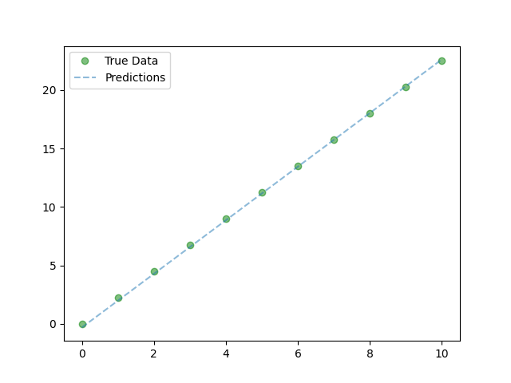

{:height="36px" width="36px"}

## Pytorch - Tutorial

Here is the plan for pytorch
1. Linear Regression

2. Logistic Regression

## About Logistic Regression
### Logistic Regression Basics
**Classification algorithm**
* Example: Spam vs No Spam
    * Input: Bunch of words
    * Output: Probability spam or not
**Basic Comparison**
* **Linear regression**:
    * Output: numeric value given inputs
* **Logistic regression**:
    * Output: probability [0, 1] given input belonging to a class