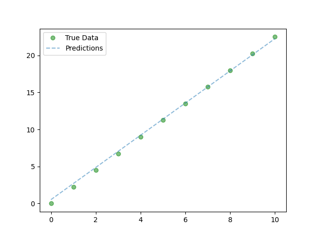

## Pytorch - Tutorial

Here is the plan for pytorch
1. Linear Regression

2. Logistic Regression

## About Logistic Regression
### Logistic Regression Basics
**Classification algorithm**
* Example: Spam vs No Spam
    * Input: Bunch of words
    * Output: Probability spam or not
**Basic Comparison**
* **Linear regression**:
    * Output: numeric value given inputs
* **Logistic regression**:
    * Output: probability [0, 1] given input belonging to a class

3. Convolutional Neural Network

* **Pooling Layer**
    *  2 common types
        * Max Pooling
        * Average Pooling

* **Padding Summary**
    *   Valid Padding (No Padding)
        *   Output size < Input Size
    *   Same Padding (Zero Padding)
        *   Output size = Input Size

**Dimension Calculations**
• O = W-K+2P + 1
    • O: output height/length
    • W: input height/length
    • K: filter size (kernel size)
    • P: padding
        • P = K-1/2
    • S. stride

